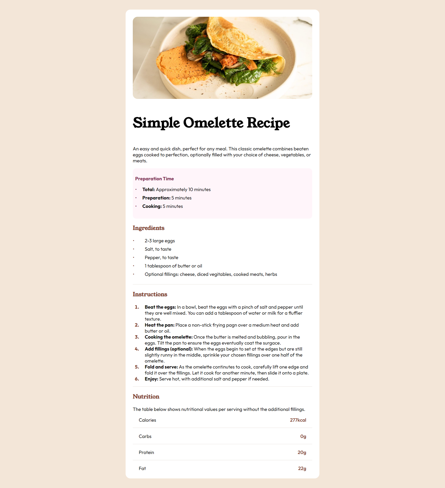

# Frontend Mentor - Recipe page solution

This is a solution to the [Recipe page challenge on Frontend Mentor](https://www.frontendmentor.io/challenges/recipe-page-KiTsR8QQKm). Frontend Mentor challenges help you improve your coding skills by building realistic projects. 

## Table of contents

- [Overview](#overview)
  - [Screenshot](#screenshot)
  - [Links](#links)
- [My process](#my-process)
  - [Built with](#built-with)
- [Author](#author)

## Overview

This was a pretty basic exercise, demonstrating my ability to create responsive static webpages. Since I have alot of exerience with development there was not alot to learn. Keep an eye out for more complicated projects! 🎉🎉🎉

### Screenshot

### Links

coming soon...
<!-- - Solution URL: [solution URL](https://www.frontendmentor.io/solutions/recipe-page-RcUFm-j4o7) -->
<!-- - Live Site URL: [live site URL]([https://your-live-site-url.com](https://front-end-challenges-recipe-page.vercel.app/)) -->

## My process

### Built with

- Semantic HTML5 markup
- CSS custom properties
- Flexbox
- CSS Grid
- Mobile-first workflow
- [React](https://reactjs.org/) - JS library

## Author

- Website - [lonewolfcode](https://www.lonewolfcode.com)
- Frontend Mentor - [@CodeCraftsmanReact](https://www.frontendmentor.io/profile/CodeCraftsmanReact)

